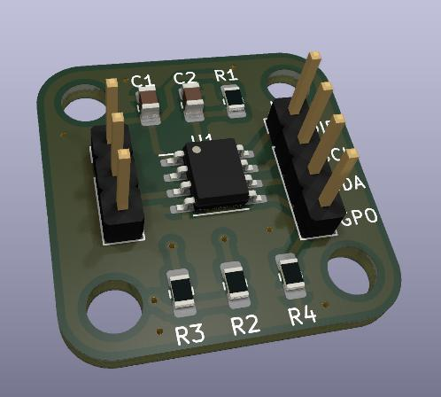

# AS5600 12-bit Absolute Encoder

[STEP File](AS5600.step)

# Caveats

In the real board the 4 pin header is a bit more to the top of the board than in the current model, so at least a 1mm tolerance should be considered.

# Where to buy

[https://s.click.aliexpress.com/e/_APSxKB](https://s.click.aliexpress.com/e/_APSxKB)
